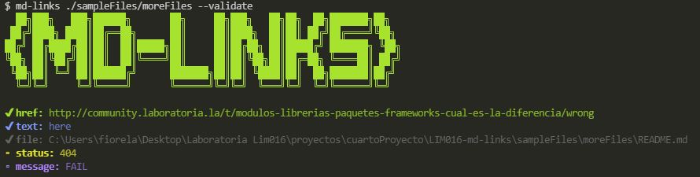
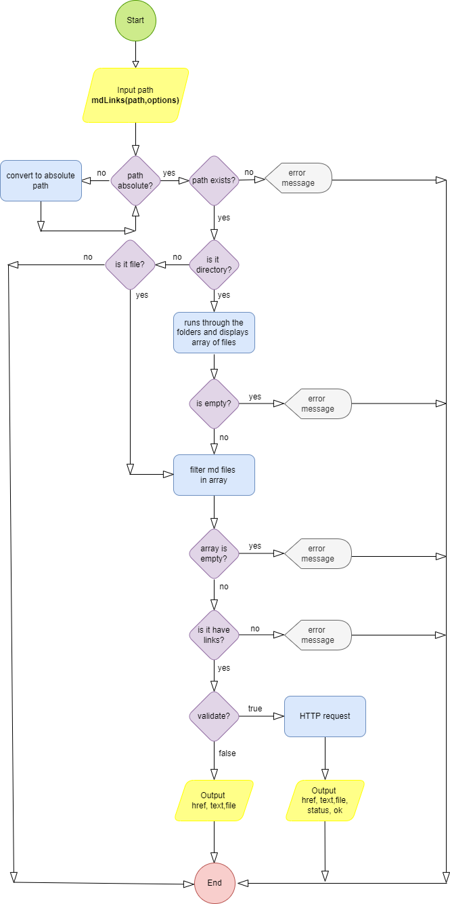

# 

It is a library that allows you to validate URLs inside markdown files. It will allow you to obtain: link status, total links, unique links and broken links.

This project was created for <a href="https://www.laboratoria.la">Laboratoria</a> Bootcamp - Lima 016 💛

***
## Getting started 🚀
These instructions will allow you to install the library on your local machine for development.

See Deployment for the library developed with Node.js.

### Installation 🔧
You can install it by npm:

```
$ npm i md-links-fioaf
```

## Guide to use ⚙️
You can run the library through the terminal:

```
mdlinks-checker <path-to-file> [options]
```

The paths entered can be **relative** or **absolute** and the options you can use are: `--help`, `--stats`, `--validate`, or use both together `--stats --validate`.

Case 1: `md-links <path-to-file>`


Case 2: `md-links <path-to-file> --validate`



Case 3: `md-links <path-to-file> --stats`


Case 4: `md-links <path-to-file> --stats --validate` or `md-links <path-to-file> --validate --stats`


Case 5: `md-links --help`


Case 6: When information is omitted or incorrect


## Flowcharts

API-flowchart



CLI-flowchart


## Built with 🛠️
* [Node.js](https://nodejs.org/en/) - Used to create the library
* [NPM](https://www.npmjs.com/) - Manage packages
* [Figlet](https://github.com/patorjk/figlet.js) - Generate banner
* [Chalk](https://github.com/chalk/chalk) - Used to style terminal output
* [CommonJS](https://nodejs.org/docs/latest/api/modules.html#modules-commonjs-modules) - Handle modules
* [node-fetch](https://www.npmjs.com/package/node-fetch) - Make HTTP calls

## Author ✒️
[Fiorela Azahuanche Falcón](https://github.com/fio-azahuanche)
